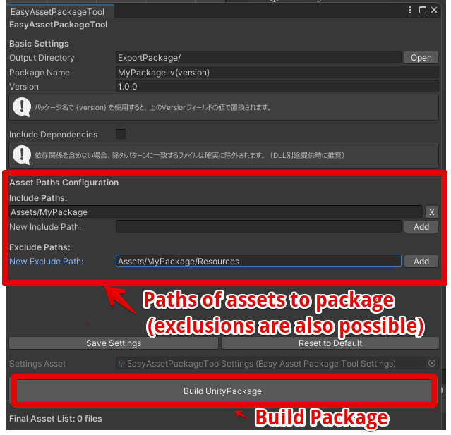

[日本語版はこちら / Japanese](README_JP.md)

# Easy Asset Package Tool

> Build `.unitypackage` files with a simple GUI — no scripting required.



## What is this?

A Unity Editor extension that lets you create `.unitypackage` files through a visual interface. Just pick the folders you want to include, set your exclude patterns, and click **Build**.

### Key Features

- **Visual package builder** — Configure everything from an EditorWindow
- **Flexible filtering** — Exclude files with wildcard patterns like `**/*.cs` or `**/Tests/**`
- **Version management** — Use `{version}` in your package name for automatic versioning
- **Live preview** — See exactly which files will be included before building
- **Persistent settings** — Your configuration is saved automatically as a ScriptableObject

## Requirements

- Unity 2022.3 LTS or later

## Getting Started

### Install via Unity Package Manager (recommended)

1. In Unity, go to **Window > Package Manager**
2. Click **+** > **Add package from git URL...**
3. Paste:
   ```
   https://github.com/Yu-Rin-Chi2/EasyAssetPackageTool.git?path=Assets/EasyAssetPackageTool
   ```

### Install manually

1. Clone this repository:
   ```
   git clone https://github.com/Yu-Rin-Chi2/EasyAssetPackageTool.git
   ```
2. Copy `Assets/EasyAssetPackageTool/` into your project's `Assets/` folder.

### Build your first package

1. Open **Tools > EasyAssetPackageTool**
2. Set an output directory and package name
3. Add the folders/files you want to include
4. (Optional) Add exclude patterns to filter out unwanted files
5. Click **Build UnityPackage**

## Contributing

Contributions are welcome! See [CONTRIBUTING.md](CONTRIBUTING.md) for guidelines.

## License

[MIT License](LICENSE)
